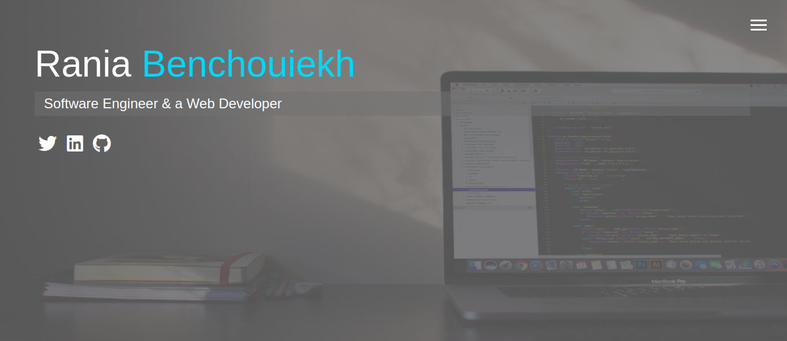
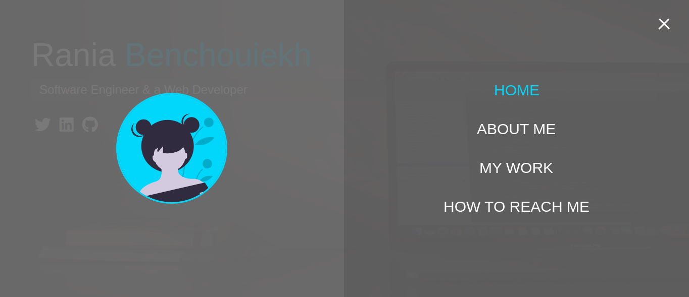
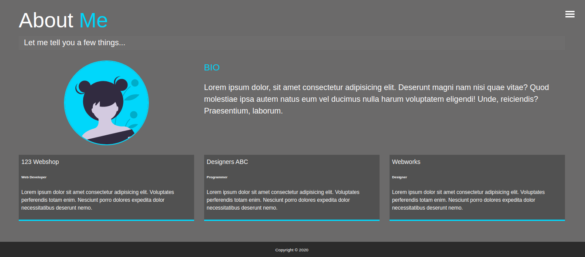
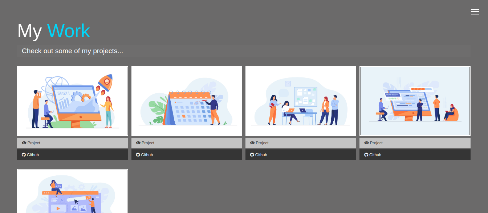
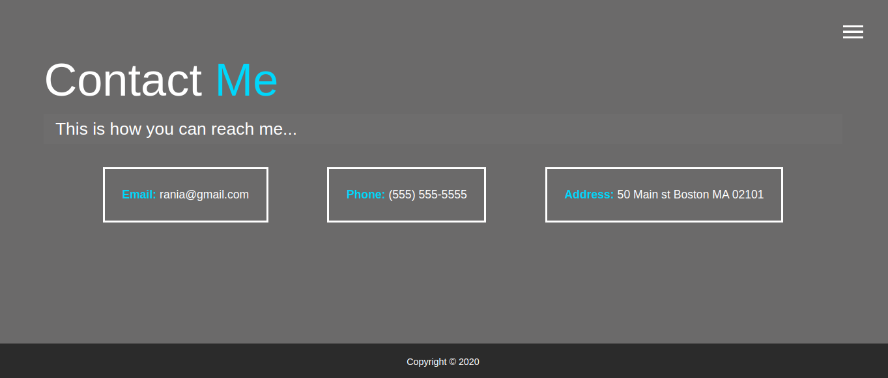

# simple-sass-portfolio

A simple, minimalist and responsive Portfolio. Created using HTML, CSS, SCSS, JavaScript.
## Screenshots

<table>
  <tr>
    <td><b>Home page</b></td>
    <td><b>Menu page</b></td>
  </tr>
  <tr>
    <td></td>
    <td></td>
  </tr>
  <tr>
    <td><b>About page</b></td>
    <td><b>Work page</b></td>
  </tr>
  <tr>
    <td></td>
    <td></td>
  </tr>
   <tr>
    <td><b>Contact page</b></td>
  </tr>
  <tr>
    <td></td>
  </tr>
 </table>
 
## Languages

<ul>
  <li>HTML</li>
  <li>SCSS</li>
  <li>CSS</li>
  <li>JavaScript</li>
  <li>JSON</li>
</ul>

## Run and deploy the projet

####  Install dependencies
You can use [**Github Pages**](https://pages.github.com/) to deploy your project, since the project is simple and does not include a backend. In this case, you will have to install dependencies such as **gh-pages** for deployement purposes, and **node-sass** for the run. Both are present in the **package.json** file, so all you have to run is the following command :

```bash
npm install 
```
or : 

```bash
yarn install 
```

#### Run the project

To run the project, you will have to use the following command :

```bash
npm run sass
```
or : 

```bash
yarn run sass 
```
This command is executed from a script in the **package.json** file : 

```bash
"scripts": 
  {
    "sass": "node-sass -w scss/ -o dist/css/ --recursive"
  }
```
The script means : Run the **node-sass** program, it will watch the **scss/** folder by using the **-w** flag, transform the scss code to regular css then output that to the **dist/css** folder using the **-o** flag, and finally the **--recursive** flag is used to prevent partials problems.

## Credits

[Brad Traversy](https://github.com/bradtraversy)

